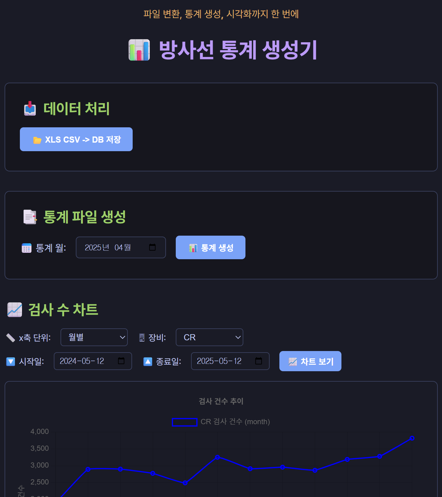

# 📊 RadStats: 방사선 통계 생성기


**RadStats**는 의료 방사선 검사 데이터를 기반으로 월간 통계 Excel 파일을 자동 생성하고, 장비별 검사 추이를 선형 그래프로 시각화할 수 있는 **Electron 기반 데스크탑 애플리케이션**입니다.

 <!-- 필요 시 캡처 이미지 삽입 -->

---

## 🛠️ 주요 기능

- `.xls` 형식의 방사선 검사 리스트를 `.csv`로 자동 변환
- 변환된 `.csv` 파일을 SQLite 데이터베이스에 저장
- 지정 월에 대한 **엑셀 통계 보고서 자동 생성**
- 장비별 검사 건수에 대한 **일/주/월 단위 시계열 그래프 제공**
- Tokyonight 스타일의 세련된 **다크모드 UI**

---

## 📁 폴더 구조

```bash
rad_status/
├── src/                  # 핵심 기능 소스 코드
│   ├── xls_to_csv.js
│   ├── save_to_sqlite.js
│   ├── write_stats_to_excel.js
│   └── chart_data.js
├── data/                 # XLS 원본 및 변환된 CSV 저장소 (Git 제외)
│   ├── raw_xls/
│   └── converted_csv/
├── db/                   # SQLite 데이터베이스 (Git 제외)
├── reports/              # 생성된 통계 엑셀 보고서 (Git 제외)
├── assets/               # 아이콘 및 리소스
├── index.html            # 메인 UI
├── style.css             # Tokyonight 테마 스타일
├── renderer.js           # 프론트엔드 렌더링 로직
├── chart.js              # Chart.js 기반 그래프 처리
├── preload.js            # Electron preload bridge
├── LICENSE               # 라이선스 파일
├── main.js               # Electron 메인 프로세스
├── package.json          # 프로젝트 메타 정보
└── .gitignore
```

---

## 🚀 설치 및 실행

### 1. 의존성 설치
```bash
npm install
```

### 3. 실행 (개발용)
```bash
npm start
```

---

## 📦 빌드 및 배포

### 윈도우용 EXE 패키징
```bash
npm run package
```

빌드 결과는 `release/` 폴더에 `RadStats-win32-x64-1.0.1/` 형식으로 생성됩니다.

---

## 📈 그래프 기능

- x축: 일별 / 주별 / 월별 선택 가능
- y축: 장비(CR, CT, MR, US)별 검사 건수
- 날짜 범위 지정: `시작일` ~ `종료일` 입력 가능

---

## ⚠️ 주의 사항

- `data/`, `db/`, `reports/` 폴더는 `.gitignore`에 포함되어 있어 Git에는 저장되지 않습니다.
- 데이터는 로컬에만 저장되며 클라우드 연동은 지원하지 않습니다.
- SQLite 파일 경로는 `db/database.sqlite`로 고정되어 있습니다.

---

## 🧰 요구사항

- Node.js v18 이상 권장
- Windows 10 이상
- Excel 파일은 `.xls` 또는 `.xlsx` 형식 지원

---

## 📌 라이선스

This project is licensed under the [MIT License](./LICENSE).  
You are free to use, modify, and distribute this software with attribution.

---

### 📃 MIT 라이선스 요약 (비공식 번역)

- 본 소프트웨어는 누구나 **자유롭게 사용, 복사, 수정, 병합, 게시, 배포**할 수 있습니다.
- 다만, **저작권 고지 및 라이선스 전문은 반드시 포함**해야 합니다.
- 이 소프트웨어는 **아무런 보증 없이 제공**됩니다. 사용에 따른 책임은 사용자에게 있습니다.


---

## 🙋‍♂️ 제작자

이우빈 - 감탄정형외과의원 영상의학과 팀장  
문의: [ss96232@naver.com](mailto:ss96232@naver.com)
